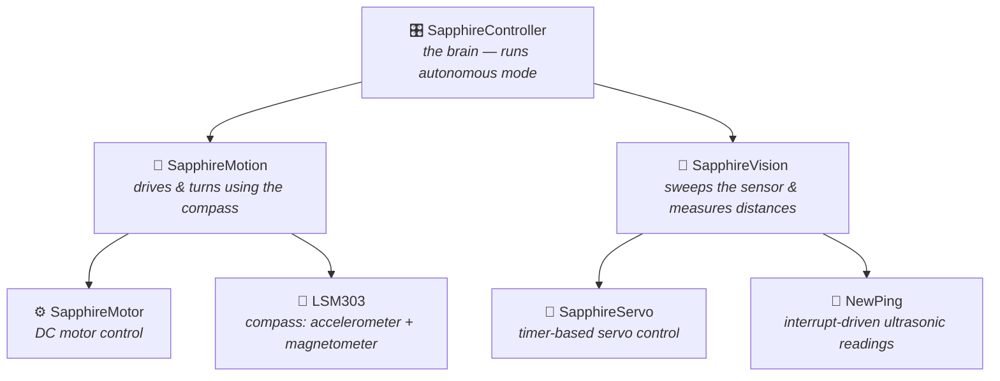

<div align="center">

# 💎 Sapphire

### An Autonomous Obstacle-Avoiding Vehicle, built from scratch on Arduino

*My final project for Harvard's CS50 — proof that a handful of C++ classes, an ultrasonic "eye," and a compass can bring a little robot to life.*


</div>

---

## 🤖 What is Sapphire?

Sapphire is a small autonomous robot that **drives around on its own and avoids obstacles**. A servo-mounted ultrasonic sensor sweeps left to right like a radar, the onboard compass keeps turns precise, and a simple decision engine picks the clearest path forward — all running on a humble Arduino UNO.

Built in 2015 as my final project for [CS50](https://cs50.harvard.edu/), Harvard's legendary intro to computer science. And here's the thing: **a decade later, nothing about this project has aged out**. The Arduino UNO is still the go-to beginner board, the HC-SR04 sensor still costs a couple of dollars, and writing your own motor/servo/sensor libraries from scratch is *still* one of the best ways to truly understand embedded programming. If you're a student looking for a first robotics project, this repo is a complete, working blueprint.

## ✨ Features

- 🧭 **Compass-guided turns** — uses the Zumo Shield's 3-axis accelerometer + magnetometer (LSM303) for accurate rotations
- 📡 **Radar-style vision** — a servo sweeps the ultrasonic sensor across the field of view and reads distances degree by degree
- 🧠 **Autonomous decision-making** — a tiny decision engine picks forward, left, right, or backward based on the nearest obstacle
- 🧩 **Clean, modular architecture** — each subsystem (motors, servo, motion, vision, controller) is its own reusable Arduino library
- 📚 **Beginner-friendly code** — every library ships with a commented example sketch you can load straight from the Arduino IDE

## 🏗️ How It's Organized

The software is split into small, single-purpose libraries — a great pattern to study if you're learning how to structure embedded code:



| Library | Role |
|---|---|
| 🎛️ [SapphireController](SapphireController/) | The main controller — contains the decision logic and the [MainController](SapphireController/examples/MainController/MainController.ino) sketch you upload to the robot |
| 🚗 [SapphireMotion](SapphireMotion/) | Motion control — combines the motors and the compass to drive and rotate precisely |
| 👀 [SapphireVision](SapphireVision/) | The vision system — controls the servo + ultrasonic sensor to scan the surroundings |
| ⚙️ [SapphireMotor](SapphireMotor/) | Low-level controller for the two DC gearmotors |
| 🔄 [SapphireServo](SapphireServo/) | Servo controller that uses a timer for smooth, precise rotation |
| 🧭 [LSM303](LSM303/) | Third-party library (by Pololu) for the Zumo Shield's compass |
| 📡 [NewPing](NewPing/) | Third-party library for fast, interrupt-based ultrasonic sensing |

*(`Wire` and `SoftwareSerial` are also used — both ship with the Arduino IDE.)*

## 🛒 Bill of Materials

Everything is off-the-shelf and still easy to find today:

| Qty | Part | Link |
|---:|---|---|
| 1 | Arduino UNO R3 | [arduino.cc](https://www.arduino.cc/en/Main/ArduinoBoardUno) |
| 1 | Pololu Zumo Shield kit for Arduino v1.2 | [pololu.com/product/2508](https://www.pololu.com/product/2508) |
| 2 | Micro Metal Gearmotor HP 75:1 | [pololu.com/product/2361](https://www.pololu.com/product/2361) |
| 1 | Standard micro servo (any will do) | [pololu.com/product/2820](https://www.pololu.com/product/2820) |
| 1 | HC-SR04 ultrasonic sensor | [robotshop.com](http://www.robotshop.com/en/hc-sr04-ultrasonic-range-finder.html) |
| 1 | Multi-purpose sensor housing | [lynxmotion.com](http://www.lynxmotion.com/p-397-multi-purpose-sensor-housing.aspx) |
| 4 | Female/female jumper wires | [robotshop.com](http://www.robotshop.com/en/200mm-f-f-40-pin-jumper-wire.html) |
| 4 | NiMH AA batteries (1.2 V, 2200 mAh) | [pololu.com/product/1003](https://www.pololu.com/product/1003) |

## 🔧 Assembling the Robot

The **Zumo Shield is the heart of Sapphire**: it provides the chassis, the motor driver, and the built-in accelerometer + magnetometer, plus expansion points for extra devices.

1. **Build the chassis** — solder and assemble the Zumo Shield following section 2 of the [official Pololu guide](https://www.pololu.com/docs/0J57/2).
2. **Mount the Arduino** — attach the UNO on top of the shield.
3. **Attach the servo** — glue the servo to the front of the shield with silicone glue, taking care to **center the white servo wheel** with respect to the frontal blade.
4. **Prepare the sensor housing** — plug a servo horn into the multi-purpose housing so the sensor can rotate, then attach the HC-SR04 following the [manufacturer's mini-guide](http://www.lynxmotion.com/images/html/mpsh-01.htm).
5. **Wire it up** — connect the sensor's VCC, GND, Echo, and Trigger lines with the jumper wires.

## 🚀 Getting Started

### 1️⃣ Install the libraries

Close the Arduino IDE and copy **every folder** of this repository into your Arduino libraries directory:

- **Windows:** `Program Files (x86)\Arduino\libraries\`
- **macOS:** `~/Documents/Arduino/libraries/`
- **Linux:** `~/Arduino/libraries/`

Reopen the IDE and check **File ▸ Examples** — the Sapphire libraries should appear in the list. Every library includes a sample sketch, commented line by line, so you can test each subsystem on its own.

### 2️⃣ Load the main sketch

Go to **File ▸ Examples ▸ SapphireController ▸ MainController**, then hit **Verify** to compile. You should see a success message like:

```
Sketch uses 14,920 bytes (46%) of program storage space. Maximum is 32,256 bytes.
Global variables use 986 bytes (48%) of dynamic memory.
```

### 3️⃣ Upload & run

Connect Sapphire over USB and click **Upload**.

> ⚠️ **Mind the switch** next to the USB connector: with it **off**, only the servo moves (great for testing on your desk); with it **on**, the servo sweeps first and then the wheels start turning — so put it on the floor!

## 🎯 Calibration

Two quick calibrations make Sapphire drive its best:

<details>
<summary><b>🔄 Servo calibration</b></summary>

1. Unplug the USB and remove the sensor housing (with the ultrasonic sensor) from the servo.
2. Press the reset button and turn Sapphire on — you'll hear **two sounds** from the servo.
3. After the second sound the servo sits at its rightmost position and begins sweeping degree by degree to the left.
4. After the second sound, turn Sapphire off and reattach the sensor housing **pointing to the right**.

On startup, Sapphire always sweeps the sensor from right to left, reading distances degree by degree.

</details>

<details>
<summary><b>🧭 Compass calibration</b></summary>

1. Plug in the USB, open the Arduino IDE, and load **File ▸ Examples ▸ LSM303 ▸ Calibrate**.
2. Upload it and open the **Serial Monitor** — you'll see two vectors (min and max limits) with X, Y, Z values.
3. Slowly rotate Sapphire a full 360° in every axis until the values stabilize, then note them down.
4. Open `SapphireMotion/SapphireMotion.cpp` and update the vectors on **lines 30–31** with your values.
5. Recompile and upload the **MainController** sketch — Sapphire is ready to explore! 🎉

</details>

## 🎓 About This Project

Sapphire was created in **November 2015** as my final project for **[CS50](https://cs50.harvard.edu/), Harvard University's Introduction to Computer Science**. CS50 famously ends with an open-ended final project — and instead of a web app, I wanted to build something that *moves*.

Ten years on, it remains a genuinely good starter robotics project:

- 🧱 **The parts are timeless** — Arduino UNO, HC-SR04, and micro servos are still the standard beginner kit, cheap and available everywhere.
- 📖 **The code teaches fundamentals** — sensor polling, PWM motor control, timers, interrupts, and clean C++ class design, with no framework hiding the details.
- 🔬 **It's hackable** — each subsystem is an independent library, so swapping in a better sensor, adding line-following, or porting to a newer board is straightforward.

If you're a CS50 student (or any student!) hunting for final project inspiration: fork it, build it, break it, and make it yours. That's what it's here for. 💙

## 📄 License

Released under the [GNU General Public License v2](LICENSE).

---

<div align="center">

*Built with ☕ and silicone glue by Tommy E. Garcia — CS50 Final Project, 2015*

**⭐ If this helped you build your first robot, consider leaving a star!**

</div>
